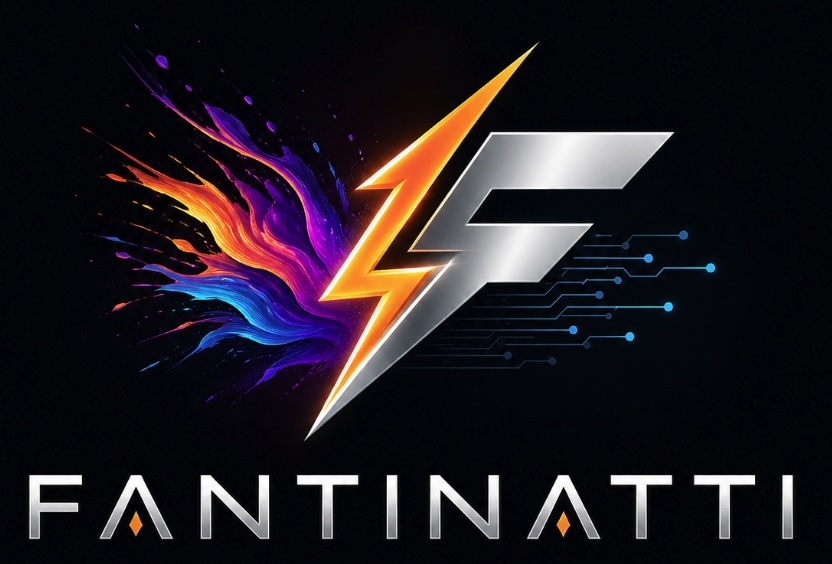
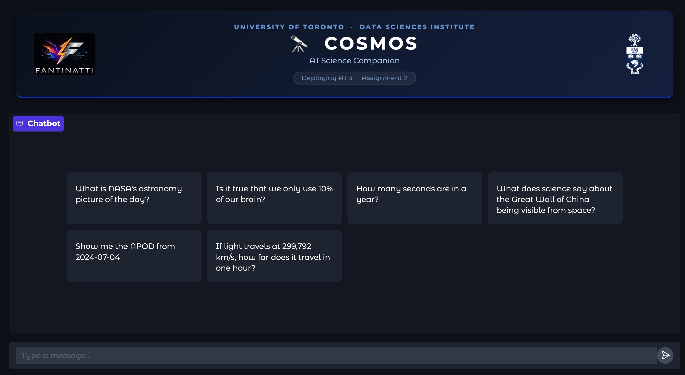

# Cosmos — AI Science Companion




**Cosmos** is a calm, curious conversational AI astronomer built for **Assignment 2** of the *Deploying AI 3* course at the **University of Toronto Data Sciences Institute**.  Ask it about today's NASA astronomy picture, fact-check a popular science claim, or hand it a maths problem — it will answer with quiet precision.

> **Live deployment:** This assignment is deployed on an AWS EC2 instance with a custom domain.
> Access it at **[https://dsi.fantinatti.net/](https://dsi.fantinatti.net/)** (login required).

[](https://www.youtube.com/watch?v=M59wXbDOpbU)

*▶ Click the image above to watch the demo on YouTube. The scenarios demonstrated in the video follow the [Test Plan](TEST_PLAN.md).*

---

## Architecture

```text
assignment_chat/
├── app.py                  # Gradio Blocks UI + LangGraph agent entry point
├── prompts.py              # Cosmos system prompt and personality
├── memory.py               # Conversation history trimming utility
├── services/
│   ├── api_service.py      # Service 1 – NASA APOD (external API)
│   ├── semantic_service.py # Service 2 – Science misconceptions (Chroma DB)
│   └── math_service.py     # Service 3 – Math tool (numexpr via LangChain)
└── data/
    └── chroma_db/          # Persistent vector store (created at runtime)
```

### LangGraph agent flow

```text
gr.Blocks  (custom HTML header with project logo + UofT crest)
  └─ gr.ChatInterface
        │  message + history
        ▼
  guardrail_check()          ← blocks banned topics & prompt-injection probes
        │
        ▼
  LangGraph MessagesState
        │
        ▼
  _call_model  (LLM node)    ← GPT-4o-mini + 3 bound tools
        │
        ├─── tool call? ──► ToolNode (routes to one of the 3 services)
        │                        │
        │◄───────────────────────┘  (tool result added to state)
        │
        ▼
  final AIMessage.content    ← returned to Gradio
```

The UI is built with `gr.Blocks`, which wraps a custom HTML banner (project logo base64-embedded, UofT coat of arms from Wikimedia) above a standard `gr.ChatInterface`.  The `ChatInterface` manages the conversation history automatically.
Each turn the full history is converted to LangChain `HumanMessage` / `AIMessage`
objects and passed to LangGraph as `MessagesState`.  A sliding window trim
(default: 20 messages ≈ 10 exchanges) prevents context-window overflow on long
sessions.

---

## Services

### Service 1 — NASA Astronomy Picture of the Day (`api_service.py`)

| Detail | Value |
| --- | --- |
| API | [NASA APOD](https://api.nasa.gov/) |
| Endpoint | `GET https://api.nasa.gov/planetary/apod` |
| Auth | `NASA_API_KEY` (see below) or public `DEMO_KEY` |
| Output transform | JSON → condensed natural-language summary with Markdown link |

The raw API response (JSON with `title`, `explanation`, `url`, …) is **not** returned verbatim.  Instead the tool extracts the title, date, and a condensed explanation (≤ 700 characters) and formats them as readable prose.

### Service 2 — Science Misconceptions Semantic Search (`semantic_service.py`)

| Detail | Value |
| --- | --- |
| Dataset | *List of common misconceptions about science* (Wikipedia-style HTML, already in `05_src/documents/`) |
| Embedding model | `text-embedding-3-small` via OpenAI / course gateway |
| Vector DB | ChromaDB with file persistence (`data/chroma_db/`) |
| Chunk size | 500 tokens, 60-token overlap |
| Retrieval | Top-3 nearest neighbours (cosine similarity) |

**Embedding process:**

1. On first launch, `ingest_documents()` is called automatically.
2. The HTML file is stripped of tags with a regex-based extractor.
3. The plain text is split with `RecursiveCharacterTextSplitter`.
4. Chunks are embedded in batches of 100 and stored in the persistent Chroma collection `science_misconceptions`.
5. On subsequent launches the stored collection is loaded directly — no re-embedding occurs.

> **Note:** The `data/chroma_db/` directory is excluded from version control.  The first run will embed the source document (requires an active API key and internet connection).

### Service 3 — Math Tool (`math_service.py`)

Wraps `math_tools.get_math_tool()` from `05_src/math_tools.py`.
The tool uses GPT-4o-mini with structured output to translate a natural-language
maths problem into a `numexpr` expression, evaluates it, and returns the result.
Supports arithmetic, word problems, and simple algebraic expressions.

---

## Guardrails

The following topics are **always refused**, regardless of phrasing:

| Category | Examples |
| --- | --- |
| Cats or dogs | cat, kitten, dog, puppy, canine, feline |
| Horoscopes / Zodiac | horoscope, zodiac, astrology, aries, taurus, … |
| Taylor Swift | "taylor swift" |

In addition, any attempt to reveal or override the system prompt is detected and
politely deflected.

---

## Setup

### 1 — Copy and fill in secrets

```bash
cp 05_src/.secrets.template 05_src/assignment_chat/.secrets
```

Edit `05_src/assignment_chat/.secrets` and fill in:

```dotenv
API_GATEWAY_KEY=<your course API gateway key>
OPENAI_API_KEY=any_value          # set to a real key if not using the gateway
NASA_API_KEY=<optional NASA key>  # omit to use the free DEMO_KEY (30 req/hr)
```

> **OPENAI_BASE_URL** defaults to the course gateway
> (`https://k7uffyg03f.execute-api.us-east-1.amazonaws.com/prod/openai/v1`).
> Override it by adding `OPENAI_BASE_URL=…` to `.secrets` if needed.

### 2 — Verify the environment

All required libraries are part of the standard course environment (`pyproject.toml`):
`langchain`, `langchain-openai`, `langgraph`, `chromadb`, `openai`, `gradio`,
`python-dotenv`, `requests`, `langchain-text-splitters`, `numexpr`.

No additional packages need to be installed.

### 3 — Run the app

```bash
cd 05_src/assignment_chat
python app.py
```

On first launch the science-facts database is ingested automatically (may take
~30 seconds depending on API latency).  Subsequent launches are instant.

Open the URL printed by Gradio (default `http://127.0.0.1:7860`) in your browser.

---

## Usage examples

| Input | Service called |
| --- | --- |
| "What is the astronomy picture of the day?" | NASA APOD |
| "Show me the APOD from 2024-12-25" | NASA APOD |
| "Is it true that we only use 10% of our brain?" | Science facts search |
| "Does lightning ever strike the same place twice?" | Science facts search |
| "How many seconds are in a leap year?" | Math tool |
| "If the speed of light is 299,792 km/s, how far does it travel in 8 minutes?" | Math tool |

---

## Limitations & future improvements

- **Science-facts coverage:** The dataset is a single Wikipedia article (~500 chunks).  Expanding to a curated multi-source corpus would improve recall.
- **DEMO_KEY rate limit:** The NASA API's free key allows 30 requests/hour and 50/day.  Adding `NASA_API_KEY` removes this constraint.
- **Guardrail brittleness:** The keyword filter can produce false positives (e.g. "cancer" the disease vs. the zodiac sign).  A lightweight classifier would be more robust.
- **Memory:** History is trimmed to the last 20 messages.  A summarisation step (using the LLM) could better compress long conversations while preserving key context.
- **Tool parallelism:** LangGraph currently runs tools sequentially; switching to a parallel tool-call pattern would reduce latency for multi-step queries.

---

## Technical Stack & Design Decisions

### Language Model

| Item | Value | Reason |
| --- | --- | --- |
| Model | `gpt-4o-mini` | Balances cost, speed, and capability for a course project; strong tool-calling support out of the box |
| Provider | OpenAI (via course API gateway) | The course provides a shared gateway (`https://k7uffyg03f.execute-api.us-east-1.amazonaws.com/prod/openai/v1`), removing the need for personal billing; authenticated with `x-api-key` header |
| Temperature | 0.7 | Gives Cosmos a slightly creative, conversational tone without sacrificing factual accuracy |
| Integration | `langchain-openai` `init_chat_model` | Single-call initialisation that handles base URL and auth header injection transparently |

### Agent Orchestration — LangGraph

| Item | Value | Reason |
| --- | --- | --- |
| Framework | LangGraph `StateGraph` | Provides a clean graph-based control flow; `tools_condition` edge handles the tool-call / final-answer branching automatically |
| State type | `MessagesState` | Built-in LangGraph type that carries the message list; avoids boilerplate state schema definition |
| Tool routing | `ToolNode` | Dispatches to whichever tool the LLM requested; no manual `if/elif` routing needed |
| Loop | `_call_model → tools_condition → ToolNode → _call_model` | Standard ReAct pattern: model decides, tool executes, result is fed back, model responds |

### Tool / Service Design

| Tool | Library / API | Why chosen |
| --- | --- | --- |
| NASA APOD (`api_service.py`) | `requests` + [NASA Open APIs](https://api.nasa.gov/) | Free, no registration required via `DEMO_KEY`; returns rich JSON (title, explanation, image URL) easily transformed into readable prose |
| Science facts search (`semantic_service.py`) | `chromadb`, `openai`, `langchain-text-splitters` | ChromaDB is lightweight and file-persistent — no Docker or external service required; embedding with `text-embedding-3-small` gives strong semantic recall at low cost |
| Math solver (`math_service.py`) | `numexpr` via `math_tools.get_math_tool()` | Reuses the course-provided utility; `numexpr` evaluates expressions safely without `eval()`; the LLM translates natural language → expression, keeping logic and computation separate |

### Vector Database — ChromaDB

| Item | Detail |
| --- | --- |
| Client type | `PersistentClient` (file-based) |
| Storage path | `assignment_chat/data/chroma_db/` |
| Collection | `science_misconceptions` |
| Embedding model | `text-embedding-3-small` (1536 dimensions) |
| Chunking | `RecursiveCharacterTextSplitter`, chunk_size=500, overlap=60 |
| Ingest strategy | Lazy — checked once at startup; no-op on subsequent runs |
| Retrieval | Top-3 nearest neighbours, cosine similarity |

ChromaDB was chosen over alternatives (Pinecone, Weaviate, FAISS) because it requires zero infrastructure setup, stores vectors as local files, and supports the standard OpenAI embedding interface.

### Dataset

| Item | Detail |
| --- | --- |
| Source | *List of common misconceptions about science* — Wikipedia-style HTML (`05_src/documents/`) |
| Format | HTML — stripped to plain text via a regex tag-remover before chunking |
| Rationale | Directly relevant to the "science facts" use case; pre-downloaded to avoid web-scraping dependencies at runtime |

### Conversation Memory

| Item | Detail |
| --- | --- |
| Implementation | `memory.py` — `trim_history()` sliding window |
| Window size | 20 messages (≈ 10 exchanges) |
| `SystemMessage` handling | Always preserved regardless of window; never trimmed |
| Rationale | Prevents context-window overflow on long sessions; simple and deterministic — no LLM call needed to compress history |

### Guardrail Implementation

| Layer | Mechanism | Rationale |
| --- | --- | --- |
| Topic filter | Frozenset keyword match (O(1) lookup) on user input | Fast, zero-latency block before any LLM call |
| Prompt injection | Fixed list of known probe strings checked in user input | Prevents jailbreak attempts from reaching the model |
| System prompt protection | Instructions embedded directly in `SYSTEM_PROMPT`; model instructed never to reveal or repeat them | Defence-in-depth: even if keyword filter is bypassed, the model is instructed to refuse |

### UI — Gradio

| Item | Detail |
| --- | --- |
| Framework | Gradio 5.x / 6.x `gr.Blocks` |
| Theme | `gr.themes.Soft()` |
| Header | Custom HTML banner with base64-embedded project logo + UofT crest (loaded from Wikimedia with `onerror` fallback) |
| Logo embedding | Local `Logo.jpg` read at startup and encoded as `data:image/jpeg;base64,…` URI — avoids Gradio static file routing |
| Chat component | `gr.ChatInterface` inside the `Blocks` layout; manages history automatically |
| CSS | Hides the default Gradio footer |

Gradio was chosen for its minimal boilerplate: a single Python function (`cosmos_chat`) wired to `gr.ChatInterface` produces a fully functional streaming-capable chat UI.

### Python Dependencies

| Package | Version constraint | Role |
| --- | --- | --- |
| `langchain` | course env | LLM abstractions, tool decorator, message types |
| `langchain-openai` | course env | OpenAI LLM + embeddings integration |
| `langgraph` | course env | Agent state graph and tool routing |
| `chromadb` | course env | Local vector store |
| `openai` | course env | Direct embeddings client (used in `semantic_service.py`) |
| `gradio` | course env | Chat UI |
| `python-dotenv` | course env | Loads `.secrets` into environment variables |
| `requests` | stdlib-adjacent | NASA APOD HTTP call |
| `langchain-text-splitters` | course env | Document chunking |
| `numexpr` | course env | Safe numeric expression evaluation in math tool |

All packages are already present in the course `pyproject.toml` — no extra installation step is required.
